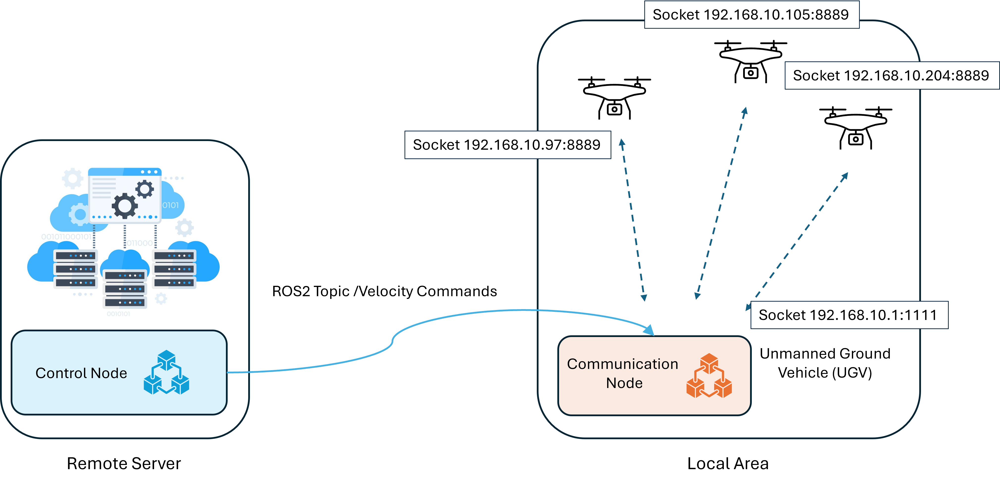
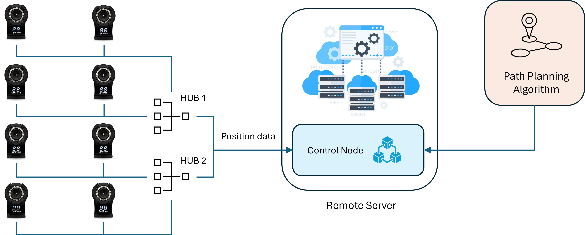

# DJI Tello EDU with ROS2

This repository contains ROS2 nodes for Finite-State-Machine formation flying of DJI Tello drones.

## Project Overview

This project involves controlling DJI Tello drones using ROS2. The nodes include functionalities for communication and control.

### Distributed System Architecture

In this project, you can run the communication node on one computer (e.g., a Raspberry Pi) and the control node on a remote server. This distributed architecture allows for efficient drone management and control, leveraging the computational capabilities of different machines. 



- **Communication Node**: This node is responsible for direct communication with the DJI Tello drones. It handles sending commands and receiving telemetry data. Running this node on a Raspberry Pi allows you to place the communication node closer to the drones, potentially improving communication reliability and reducing latency.

- **Control Node**: This node handles the higher-level control logic, including processing motion capture data and generating control commands. Running this node on a remote server allows you to leverage more powerful computational resources for processing complex algorithms and handling multiple drones simultaneously.

This separation allows for scalable and flexible deployment in various environments, optimizing performance based on the specific needs of your application.

## Setup Drone

### 1. Update the Drone Firmware

1. Download the Tello App using the following link: [Tello App Download](https://www.dji.com/ca/downloads/djiapp/tello).
2. Ignore the "connect Tello" button by pressing exit at the top right of the screen and then download the latest firmware.
3. Turn off the cellular data, turn on the drone, and connect the phone Wi-Fi to the drone's SSID.
4. Open the Tello app and press "connect tello."
5. Go to the `Setting > More > ... > Firmware Version - Update` to update the firmware.

### 2. Wi-Fi Setting

1. Restart the drone and use the `wifi_setup.py` code to set the SSID and Password of your modem (or Wi-Fi hotspot). You should change the `your_SSID` and `your_password` in the code.
2. Get the drone IP using `ip neighbor` in the Linux terminal.

## Installing and Using mocap4r2

mocap4r2 is a ROS2 package designed to integrate motion capture systems with ROS2. It provides tools and nodes to interface with motion capture systems, allowing for real-time tracking and data integration in ROS2 applications. This project uses mocap4r2 to integrate OptiTrack Flex 13 cameras.



1. Ensure your motion capture cameras are set up and calibrated correctly.
2. Make sure that the configuration file is correct. The server_address is the IP of the PC that runs the motion capture software, and local_address is the IP address of the PC that runs the mocap4r2.
3. Launch the mocap4r2 nodes to start streaming motion capture data to ROS2:
```
ros2 launch mocap4r2_optitrack_driver optitrack2.launch.py
```
4. As the driver node is a lifecycle node, you should transition to activate:
```
ros2 lifecycle set /mocap4r2_optitrack_driver_node activate
```
For more information, visit the [mocap4r2](https://github.com/MOCAP4ROS2-Project/mocap4ros2_optitrack) GitHub repository.

## Run the ROS2 Node
Clone the repository:
```
git clone git@github.com:NickTayefe/DJI-Tello-EDU.git
cd DJI-Tello-EDU
```
Change your directory to your ROS2 workspace on the local computer (e.g., Raspberry Pi) and run the communication node:
```
cd ~/'your_ros2_workspace'
colcon build --packages-select tello_driver
source install/setup.bash
ros2 run tello_communication_node

```
Change your directory to your ROS2 workspace on the remote computer (e.g., EDGE PC) and run the control node:

```
cd ~/'your_ros2_workspace'
colcon build --packages-select tello_driver
source install/setup.bash
ros2 run control_node

```

## Issues and Contributions

If you encounter any issues, please open an issue on GitHub. Contributions are welcome!

This code is tested on Ubuntu 22 and ROS2 Humble.

## License

This project is licensed under the MIT License.
=======
# Finite_State_Machine-Formation-Flying-for-DJI-Tello

